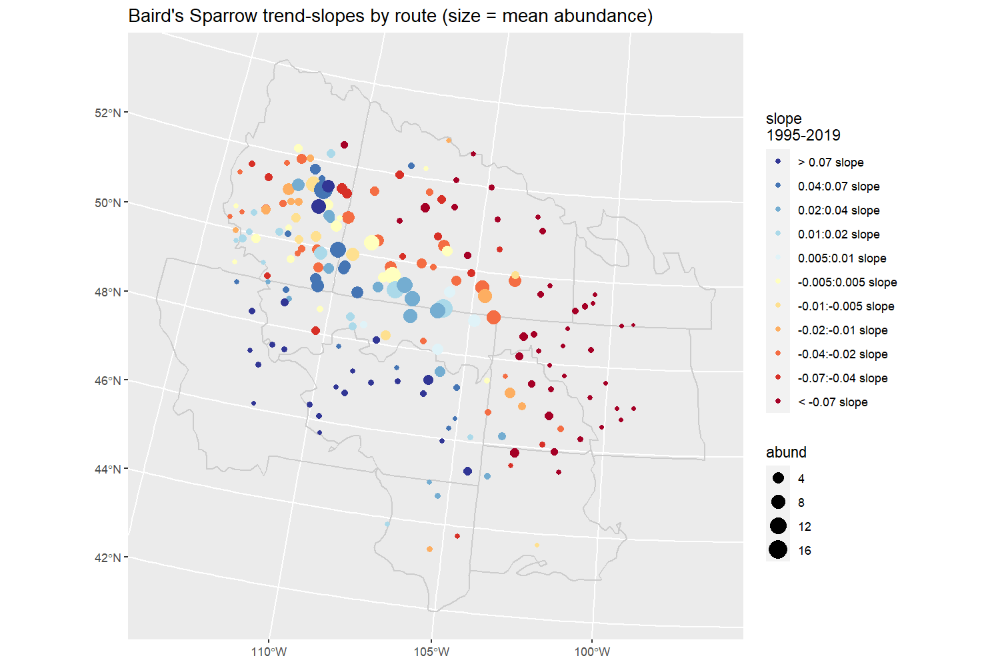

# BBS_iCAR_route_trends

A spatial iCAR model to estimate route-level trends from BBS data.

The model is written in Stan. It is based on the [bbsBayes](https://github.com/BrandonEdwards/bbsBayes), slope model (e.g., [Sauer and Link 2011](https://doi.org/10.1525/auk.2010.09220)), but without the random year-effects, and with no particular stratification. It's effectively an over-dispersed Poisson regression model with random slopes representing the trends at each route, random intercepts representing the mean abundance (mean count) on each route, as well as the among and within observers effects (true observers, see below)

## Observer effects

The observer effects here are random effects for each observer, not the observer-route combinations, used in the bbsBayes models. This is a new thing for the hierarchical Bayesian BBS models. The MCMC algorithm of JAGS and BUGS has a great deal of trouble separately estimating observer effects from route-level intercepts. The HMC algorithm in Stan, plus the spatially explicit estimates of the route-level intercepts, appears to have much more success.

## Example output - Baird's Sparrow 1995-2019

Baird's Sparrow trends in the Great Plains. Dots represent BBS routes on which Baird's Sparrow has been observed between 1995 and 2019. Over this time period, there's an interesting spatial pattern: declines in the Northeast, increases in the Southwest, and generally stable or increasing at the routes where the species is most abundant.

